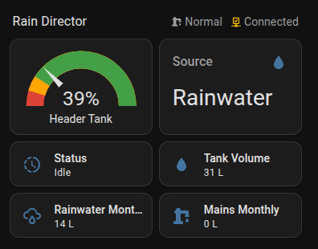

# ESPHome Rain Director

Monitor and track water usage from a Rain Director rainwater tank system. The Rain Director is provided by a company called Rainwater Harvesting in the UK.

This project interfaces with the Rain Director controller via UART communication to decode operational modes and status codes. The protocol was reverse-engineered by monitoring the serial output, and not all codes have been identified yet. Contributions via PRs or issues are welcome to expand the code mappings.

This project is not affiliated with the manufacturer in any way and takes no responsibility for any issues caused by connecting an ESP32 to the Rain Director.



## Features

- Real-time header tank level monitoring
- Track rainwater vs mains water consumption
- Tank volume calculation
- Water source tracking
- Consumption counters with reset capability
- WiFi connectivity with fallback AP
- Home Assistant integration

## Hardware Requirements

| Component | Description | Approx. Cost |
|-----------|-------------|--------------|
| ESP32 DevKit V1 | Main microcontroller | £5-10 |
| MAX485 Module | RS-485 to TTL converter (auto-direction) | £1-3 |
| 12V to 5V Buck Converter | Power from Rain Director | £2-5 |
| RJ45 Breakout Board | Easy connection to Rain Director | £2-5 |
| Cat5/Cat6 Cable | Short patch cable to cut | £1-3 |
| Dupont Jumper Wires | For connections | £2-5 |

**Total: ~£15-30**

**IMPORTANT:** The MAX485 module MUST be an "auto-direction" type that automatically switches between transmit and receive modes. Modules requiring DE/RE control pins are not supported by this configuration.

## Hardware Setup

The Rain Director has a spare RJ45 socket on the bottom of the controller that provides RS-485 communication and power.

### Rain Director RJ45 Pinout

The RJ45 sockets on the bottom of the Rain Director are interchangable and both pinned as follows:

- **Pin 1 (Orange/White)**: RS-485 A (Data+)
- **Pin 2 (Orange)**: RS-485 B (Data-)
- **Pin 3 (Green/White)**: Unknown (1.3V)
- **Pin 4 (Blue)**: GND
- **Pin 5 (Blue/White)**: GND
- **Pin 6 (Green)**: Unknown (1.4V)
- **Pin 7 (Brown/White)**: +12V
- **Pin 8 (Brown)**: +12V

### Wiring Instructions

#### Step 1: Power Supply (12V to 5V for ESP32)

1. Connect **RJ45 Pin 7 or 8** (+12V) to the **Buck Converter IN+**
2. Connect **RJ45 Pin 4 or 5** (GND) to the **Buck Converter IN-**
3. Set the buck converter output to **5V**
4. Connect **Buck Converter OUT+** to **ESP32 VIN** pin
5. Connect **Buck Converter OUT-** to **ESP32 GND** pin

#### Step 2: RS-485 Communication (Rain Director to ESP32)

1. Connect **RJ45 Pin 1** (RS-485 A) to **MAX485 A** terminal
2. Connect **RJ45 Pin 2** (RS-485 B) to **MAX485 B** terminal
3. Connect **RJ45 Pin 4 or 5** (GND) to **MAX485 GND**
4. Connect **ESP32 3V3** pin to **MAX485 VCC**
5. Connect **ESP32 GND** to **MAX485 GND**
6. Connect **MAX485 TXD** to **ESP32 RX2** (GPIO16)
7. Connect **MAX485 RXD** to **ESP32 TX2** (GPIO17)

**Notes**:
- The MAX485 is powered from the ESP32's 3V3 output pin (it draws minimal current)
- The MAX485 module should be an auto-direction type (no DE/RE control needed)
- If data is garbled, try swapping the A and B connections

### Connection Summary

**Power**: Rain Director 12V → Buck Converter (12V→5V) → ESP32 VIN

**Data**: Rain Director RS-485 → MAX485 (RS-485→TTL) → ESP32 UART2 (GPIO16/17)

**Baud Rate**: 9600 (pre-configured in the YAML)

## Software Installation

Once your ESP32 is wired up and powered, you can install the firmware.

### Option 1: Quick Install via ESPHome Web (Easiest)

This method works directly in your web browser without needing Home Assistant:

1. Connect your ESP32 to your computer via USB
2. Click this button to open ESPHome Web with the configuration pre-loaded:

   <a href="https://web.esphome.io/?dashboard_install" target="_blank">
     
   </a>

3. Click **"Connect"** and select your ESP32's serial port
4. Click **"Install"** and choose **"Prepare for first use"**
5. When prompted, paste this configuration:

```yaml
substitutions:
  name: "rain-director"
  friendly_name: "Rain Director"
  tank_capacity: "80.0"

packages:
  remote_package:
    url: https://github.com/pturner1989/esphome-rain-director
    ref: main
    files: [rain-director.yaml]
    refresh: 1d

wifi:
  ssid: "YOUR_WIFI_SSID"
  password: "YOUR_WIFI_PASSWORD"
```

6. Replace `YOUR_WIFI_SSID` and `YOUR_WIFI_PASSWORD` with your actual WiFi credentials
7. Click **"Install"** and wait for the firmware to compile and upload

### Option 2: ESPHome Dashboard (For Home Assistant Users)

1. In the ESPHome Dashboard, click **"+ NEW DEVICE"**
2. Click **"CONTINUE"** and give it a name (e.g., "Rain Director")
3. Select your ESP32 board type (e.g., "ESP32")
4. Click **"SKIP"** on the next screen
5. Click **"EDIT"** on the newly created device
6. Replace the entire contents with this configuration:

```yaml
substitutions:
  name: "rain-director"
  friendly_name: "Rain Director"
  tank_capacity: "80.0"  # Change to your tank capacity in liters

packages:
  remote_package:
    url: https://github.com/pturner1989/esphome-rain-director
    ref: main
    files: [rain-director.yaml]
    refresh: 1d

wifi:
  ssid: !secret wifi_ssid
  password: !secret wifi_password
```

7. Adjust the `tank_capacity` if needed (default is 80 liters)
8. Click **"SAVE"** and then **"INSTALL"**
9. Choose your installation method (USB, Wireless, etc.)

**How it works**: This minimal config imports the full Rain Director configuration from GitHub using ESPHome's `packages` feature. Updates are checked daily, so you'll automatically get improvements to the component.

### Advanced: Local Installation

**Note:** Most users should use Options 1 or 2 above. Local installation is only needed for advanced customization or offline development.

If you want to customize the configuration or work offline:

1. Clone this repository:
   ```bash
   git clone https://github.com/pturner1989/esphome-rain-director.git
   ```
2. Copy the `rain-director.yaml` and `components/` folder to your ESPHome config directory
3. Adjust the configuration as needed
4. Compile and upload using ESPHome

## Configuration

### Tank Capacity

Edit the substitution in the YAML file to match your tank size:

```yaml
substitutions:
  tank_capacity: "100.0"  # Change to your header (loft) tank capacity in litres, 100L is the standard supplied "smart header tank"
```

### Custom Component

This project uses a custom `rain_director` component located in the `components/` directory. Make sure this directory is included in the esphome directory when deploying.

## Communication Protocol

The Rain Director communicates via UART (9600 baud) sending periodic status updates. The custom component parses these messages to extract:

- **Mode** - Operational modes like Normal, Holiday, and Refresh
- **State** - Controller states like Idle, Filling, and Draining
- **Tank level** - Water level as a percentage
- **Water source** - Whether the system is using rainwater or mains

### Message Format

The Rain Director sends hexadecimal codes in the format:

```
<DDCCPPPPPPCC
```

Where:
- `<` - Start delimiter
- `DD` - Device ID (2-digit hex)
  - `10` = Display panel
  - `20` = Level sensor
  - `30`, `40` = Other devices (purpose unknown)
- `CC` - Command/message type (2-digit hex)
  - `53` = Status/data message
  - `71` = Version query
  - `10` = Heartbeat
  - `33` = Unknown
- `PPPPPP` - Payload (variable length hex data)
  - For device 10 (display): First 2 bytes are the mode code
  - For device 20 (level): First 2 bytes are the tank level percentage (0-100)
- `CC` - Checksum (2-digit hex)

Example messages:
- `<1053000080XX` - Display panel showing mode code 0x00 (Filling)
- `<20535080XX` - Level sensor reporting 50% full

### Known Mode Codes

The display panel (device 10) sends mode codes that have been reverse-engineered:

- `0x00` = Filling (rainwater or refresh fill)
- `0x01` = Normal mode, idle (rainwater)
- `0x04` = Normal mode, idle (mains selected)
- `0x08` = Holiday mode, idle
- `0x0C` = Holiday mode, filling from mains
- `0x10` = Refresh mode, draining

The mode and state code mappings were determined by monitoring the serial output and correlating with observed behavior. Not all possible codes have been identified. If you discover additional codes, please contribute via:

- Opening an issue with the full hex code or mode+status codes (available as diagnostic sensors) and observed behavior
- Submitting a PR to add new code mappings to the component

## Sensors

- **Tank Level** - Tank fill percentage (0-100%)
- **Tank Volume** - Current water volume in liters
- **Rainwater Used** - Total rainwater consumption
- **Mains Used** - Total mains water consumption
- **Mode** - Current operating mode (Normal, Holiday, Refresh)
- **Status** - Controller status (Idle, Filling, Draining)
- **Source** - Current water source (Rainwater/Mains)

## Controls

- **Restart** - Restart the ESP32
- **Reset Consumption Counters** - Reset rainwater and mains usage totals

## License

This project is MIT-license open source.

## Contributing

Contributions are welcome! Please open an issue or submit a pull request.
