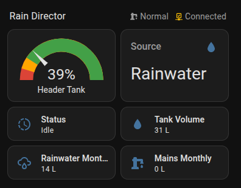

# ESPHome Rain Director

Monitor and track water usage from a "Rain Director" rainwater tank system. The Rain Director is provided by a company called Rainwater Harvesting Ltd in the UK.

This project interfaces with the Rain Director controller via the spare RJ45 socket on the device, using UART communication to decode operational modes and status codes. The protocol was reverse-engineered by monitoring the serial output, and not all codes have been identified yet. Contributions via PRs or issues are welcome to expand the code mappings.

This project is not affiliated with the manufacturer in any way and takes no responsibility for any issues caused by connecting an ESP32 to the Rain Director.



## Features

- Real-time header tank level monitoring
- Track rainwater vs mains water consumption
- Tank volume calculation
- Water source tracking
- Consumption counters with reset capability
- Optional bus capture and replay for protocol discovery
- WiFi connectivity with fallback AP
- Home Assistant integration

## Hardware Requirements

| Component | Description | Approx. Cost |
|-----------|-------------|--------------|
| ESP32 DevKit V1 | Main microcontroller | £5-10 |
| MAX485 Module | RS-485 to TTL converter (auto-direction) | £1-3 |
| 12V to 5V Buck Converter | Power from Rain Director | £2-5 |
| RJ45 Breakout Board | Easy connection to Rain Director | £2-5 |
| Cat5/Cat6 Cable | Short patch cable to cut | £1-3 |
| Dupont Jumper Wires | For connections | £2-5 |

**Total: ~£15-30**

**IMPORTANT:** The MAX485 module MUST be an "auto-direction" type that automatically switches between transmit and receive modes. Modules requiring DE/RE control pins are not supported by this configuration.

## Hardware Setup

The Rain Director has a spare RJ45 socket on the bottom of the controller that provides RS-485 communication and power.

### Rain Director RJ45 Pinout

The RJ45 sockets on the bottom of the Rain Director are interchangeable and both pinned as follows:

- **Pin 1 (Orange/White)**: RS-485 A (Data+)
- **Pin 2 (Orange)**: RS-485 B (Data-)
- **Pin 3 (Green/White)**: Unknown (1.3V)
- **Pin 4 (Blue)**: GND
- **Pin 5 (Blue/White)**: GND
- **Pin 6 (Green)**: Unknown (1.4V)
- **Pin 7 (Brown/White)**: +12V
- **Pin 8 (Brown)**: +12V

### Wiring Instructions

#### Step 1: Power Supply (12V to 5V for ESP32)

1. Connect **RJ45 Pin 7 or 8** (+12V) to the **Buck Converter IN+**
2. Connect **RJ45 Pin 4 or 5** (GND) to the **Buck Converter IN-**
3. Set the buck converter output to **5V**
4. Connect **Buck Converter OUT+** to **ESP32 VIN** pin
5. Connect **Buck Converter OUT-** to **ESP32 GND** pin

#### Step 2: RS-485 Communication (Rain Director to ESP32)

1. Connect **RJ45 Pin 1** (RS-485 A) to **MAX485 A** terminal
2. Connect **RJ45 Pin 2** (RS-485 B) to **MAX485 B** terminal
3. Connect **RJ45 Pin 4 or 5** (GND) to **MAX485 GND**
4. Connect **ESP32 3V3** pin to **MAX485 VCC**
5. Connect **ESP32 GND** to **MAX485 GND**
6. Connect **MAX485 TXD** to **ESP32 RX2** (GPIO16)
7. Connect **MAX485 RXD** to **ESP32 TX2** (GPIO17)

**Notes**:
- The MAX485 is powered from the ESP32's 3V3 output pin (it draws minimal current)
- The MAX485 module should be an auto-direction type (no DE/RE control needed)
- If data is garbled, try swapping the A and B connections

### Connection Summary

**Power**: Rain Director 12V → Buck Converter (12V→5V) → ESP32 VIN

**Data**: Rain Director RS-485 → MAX485 (RS-485→TTL) → ESP32 UART2 (GPIO16/17)

**Baud Rate**: 9600 (pre-configured in the YAML)

## Software Installation

Once your ESP32 is wired up and powered, you can install the firmware.

### Option 1: ESPHome Dashboard

1. In the ESPHome Dashboard, click **"+ NEW DEVICE"**
2. Click **"CONTINUE"** and give it a name (e.g., "Rain Director")
3. Select your ESP32 board type (e.g., "ESP32")
4. Click **"SKIP"** on the next screen
5. Click **"EDIT"** on the newly created device
6. Replace the entire contents with this configuration:

```yaml
substitutions:
  name: "rain-director"
  friendly_name: "Rain Director"
  tank_capacity: "80.0"  # Change to your tank capacity in liters

packages:
  remote_package:
    url: https://github.com/pturner1989/esphome-rain-director
    ref: main
    files: [rain-director.yaml]
    refresh: 1d

wifi:
  ssid: !secret wifi_ssid
  password: !secret wifi_password
```

7. Adjust the `tank_capacity` if needed (default is 80 liters, the standard tank is 100 litres but 80 seemed to align better with observed usage for me, maybe depends on sensor positioning)
8. Click **"SAVE"** and then **"INSTALL"**
9. Choose your installation method (USB, Wireless, etc.)

**How it works**: This minimal config imports the full Rain Director configuration from GitHub using ESPHome's `packages` feature. Updates are checked daily, so you'll get improvements to the component such as newly discovered modes, when you update the device firmware.

### Advanced: Local Installation

**Note:** Most users should use Options 1 above. Local installation is only needed for advanced customization or offline development.

If you want to customize the configuration or work offline:

1. Clone this repository:
   ```bash
   git clone https://github.com/pturner1989/esphome-rain-director.git
   ```
2. Copy the `rain-director.yaml` and `components/` folder to your ESPHome config directory
3. Adjust the configuration as needed
4. Compile and upload using ESPHome

## Configuration

### Tank Capacity

Edit the substitution in the YAML file to match your tank size:

```yaml
substitutions:
  tank_capacity: "100.0"  # Change to your header (loft) tank capacity in litres, 100L is the standard supplied "smart header tank"
```

### Custom Component

This project uses a custom `rain_director` component located in the `components/` directory to read the RS-485 data and extract the mode codes. Make sure this directory is included in the esphome directory when deploying.

## Troubleshooting

### No Data from Rain Director

If sensors are not updating or showing no data:

- Try restarting the Rain Director controller (power cycle it)
- Verify UART connections (GPIO16 to MAX485 TXD, GPIO17 to MAX485 RXD)
- Check ESPHome logs for UART data (should see hex codes like `<2053...`)
- Ensure MAX485 module is properly powered (3.3V from ESP32)

### Garbled or Incorrect Data

If sensor data appears incorrect or garbled:

- Swap the RS-485 A and B wire connections on the MAX485 module
- Verify baud rate is 9600 (configured in rain-director.yaml)
- Ensure MAX485 module is auto-direction type

### WiFi Connection Issues

If the ESP32 is not connecting to WiFi:

- Check WiFi credentials in your YAML configuration
- If credentials are incorrect, ESP32 will create a fallback WiFi access point named "[Device Name] Fallback"
- Connect to the fallback AP and use the captive portal to configure WiFi

### Sensors Not Appearing in Home Assistant

If sensors don't appear in Home Assistant after installation:

- Verify ESP32 is connected to WiFi (check ESPHome logs)
- Check that Home Assistant API is enabled (should be auto-discovered)
- Wait 30-60 seconds for sensors to appear after first boot
- Check sensor names match your device name substitution

### Mode Shows as "Unknown" During Initialization

If the Mode sensor briefly shows "Unknown" when the Rain Director or ESP32 starts:

- This is expected behavior during initialization while waiting for first messages to arrive
- The state will self-correct within 1-2 seconds as UART messages arrive
- Init modes (Init/Draining, Init/Filling) appear only during Rain Director boot-up and typically last 30-60 seconds
- If "Unknown" persists beyond a few seconds, check UART connections and ESPHome logs for warnings about unrecognized mode/status combinations

## Communication Protocol

The Rain Director communicates via UART (9600 baud) sending periodic status updates. The custom component parses these messages to extract:

- **Mode** - Operational modes like:
   - Calibration - Sequence run when the Rain Director is turned on
   - Normal - Manually set to rainwater or mains mode and operating normally
   - Backup - Failover to mains as rainwater tank is empty or pump is faulty
   - Holiday - Header tank refreshed with mains water, revert to rainwater on next refill (set manually on controller)
   - Refresh - Header tank drained and refilled from the outside rainwater tank (set manually on controller)
- **State** - Controller states like
   - Idle - All valves closed
   - Filling - Fill valve for active water source open, header tank filling
   - Draining - Drain valve open, water draining to outside rainwater tank
- **Tank level** - Water level as a percentage
- **Water source** - Whether the system is currently using rainwater or mains
- **Tank Volume** - Water volume in the tank in Litres (dependent on correct tank_capacity being set in config)

The component uses a **composite key matching system** that combines both the mode byte (from hex codes) and status byte (from JSON messages) to accurately determine the operational state. Some mode codes require specific status byte values for correct interpretation (status-specific mappings), while others work with any status value (status-agnostic fallback matching). The status byte is used internally for composite key matching but is not exposed as a separate sensor.

### Message Format

The Rain Director sends hexadecimal codes in the format:

```
<DDCCPPPPPPCC
```

Where:
- `<` - Start delimiter
- `DD` - Device ID (2-digit hex)
  - `10` = Display panel
  - `20` = Level sensor
  - `30`, `40` = Other devices (purpose unknown)
- `CC` - Command/message type (2-digit hex)
  - `53` = Status/data message
  - `71` = Version query
  - `10` = Heartbeat
  - `33` = Unknown
- `PPPPPP` - Payload (variable length hex data)
  - For device 10 (display): First 2 bytes are the mode code
  - For device 20 (level): First 2 bytes are the tank level percentage (0-100)
- `CC` - Checksum (2-digit hex)

Example messages:
- `<1053000080XX` - Display panel showing mode code 0x00 (Filling)
- `<20535080XX` - Level sensor reporting 50% full

### Known Mode Codes

The display panel (device 10) sends mode codes that have been reverse-engineered. The component uses a **composite key matching system** that combines both the mode byte (from hex codes) and status byte (from JSON messages) to accurately identify the Rain Director's operational state.

- `0x00` = Filling (rainwater or refresh fill)
- `0x01` = Normal mode, idle (rainwater)
- `0x02` = Backup mode, idle (mains, backup)
- `0x04` = Normal mode, idle (mains selected)
- `0x08` = Holiday mode, idle
- `0x0C` = Holiday mode, filling from mains
- `0x10` = Refresh mode, draining
- `0xC0` = Calibration mode, draining
- `0xC0` = Calibration mode, refilling from rainwater to 70%, then mains until stopped by float valve (determines sensor reading when full)

The mode and state code mappings were determined by monitoring the serial output and correlating with observed behavior. Not all possible codes have been identified. If you discover additional codes, please contribute via:

- Opening an issue with the full hex code or mode+status codes (available as diagnostic sensors) and observed behavior
- Submitting a PR to add new code mappings to the component, located in `components/rain_director/rain_director.cpp`

## Bus Capture and Replay

To help with the work above, the firmware can log every byte that crosses the RS-485 bus, and can write bytes of your choosing back onto it. Both are driven by the **Bus Capture** switch, which you will find under the device's configuration entities with a bug icon.

Bus Capture is **off after every restart** and does not remember its previous state. If you never switch it on, nothing about the device changes.

### Watching the bus

1. Switch **Bus Capture** on.
2. Open the device's logs (the ESPHome Dashboard log viewer, `esphome logs`, or the Home Assistant ESPHome integration's "Visit Device" log page).
3. Each group of bytes now produces two lines:

```
[19:34:02][I][rd.rx:123]: 3C 31 30 35 33
[19:34:02][I][rd.rx.text:123]: <1053
```

| Tag | Meaning |
|-----|---------|
| `rd.rx` | Bytes the device **received** from the bus |
| `rd.tx` | Bytes the device **sent** to the bus |
| `rd.rx.text` / `rd.tx.text` | The same bytes as printable characters, with `.` for anything unprintable |
| `rd.replay` | Warnings from the replay action |

The `rd.rx` and `rd.tx` lines are the ones to copy. The `.text` lines are for reading only — replay never accepts them.

Each group costs two log lines and a short blocking pause, so capture is meant for a session at the bench, not for permanent use. If lines seem to go missing under heavy traffic, that is the known cost of the second line.

### Replaying bytes

With Bus Capture on, call the device's `replay_bytes` action from **Developer Tools → Actions** in Home Assistant. It takes one text field, `hex`. In YAML mode:

```yaml
action: esphome.rain_director_replay_bytes
data:
  hex: "DE AD BE EF"
```

If your device name carries a MAC suffix, the action name will carry it too — pick the entry the Actions list offers you.

`DE AD BE EF` is used here deliberately: it is obviously not a Rain Director frame, so the component will not parse it and the controller will ignore it. It proves the path works without asking the controller to do anything. Do **not** use it as a template for real frames without reading the warnings below.

Accepted input:

- Hexadecimal digit pairs in either case. A separator between pairs is optional: use one or more spaces, colons, commas or hyphens, or run the digits together
- Leading and trailing whitespace is trimmed
- A whole copied log line works as-is: everything up to and including the last `]: ` is discarded, so `[19:34:02][I][rd.rx:123]: DE AD BE EF` is the same input as `DE AD BE EF`
- Maximum 256 bytes

Nothing else is skipped. Any other unrecognised character rejects the whole input, so a timestamp is never mistaken for data. When input is refused, a warning under the `rd.replay` tag says why and nothing is sent:

```
Replay needs Bus Capture on. Nothing sent.
Replay input is empty. Nothing sent.
Replay input '...' holds no bytes. Nothing sent.
Replay input '...' holds a character that is not a hex digit or a separator. Nothing sent.
Replay input is longer than the 256 byte limit. Nothing sent.
No gap in 800ms. Sending anyway; a collision may corrupt this frame or another.
Replay input '...' is not whole hex digit pairs. Nothing sent.
```

When the input is accepted, the log shows an `rd.tx` line with the bytes you sent.

### Warnings

- **Replay waits for a quiet bus before writing.** The bus is half-duplex and shared, so a blind write
  can collide with a frame already in flight and corrupt it. Replay watches for a gap of about 4ms
  and gives up after 800ms, sending anyway with a warning. A collision is less likely, not impossible.
- **Replay writes to a controller that operates mains water valves.** Choose what you send deliberately. Replaying a captured display or level frame can make the controller act.
- **The bus is half-duplex and shared.** A replayed frame can collide with a frame already in flight. The worst case is a corrupted read and a retry.
- **Switch Bus Capture off when the session ends.** Nothing turns it off except a restart.
- **You will probably hear your own bytes.** The MAX485 module is auto-direction, so replayed bytes usually come straight back as an `rd.rx` line with identical content. If a sensor value moves at that moment, the device has parsed its own echo. **That is not proof that the controller replied.** An echo is immediate and byte-for-byte identical; a genuine reply would differ in content, or arrive after a gap.

### Finishing a session

Switch **Bus Capture** off. The logs return to normal and the replay action stops accepting input.

## Sensors

- **Tank Level** - Tank fill percentage (0-100%)
- **Tank Volume** - Current water volume in liters
- **Rainwater Used** - Total rainwater consumption
- **Mains Used** - Total mains water consumption
- **Mode** - Current operating mode (Normal, Holiday, Refresh, Calibration, Backup)
- **Status** - Controller status (Idle, Filling, Draining)
- **Source** - Current water source (Rainwater/Mains)
- **Mode Code** - Raw mode byte as a number, for diagnostic purposes
- **State Code** - Raw state byte as a number, for diagnostic purposes

## Controls

- **Restart** - Restart the ESP32
- **Reset Consumption Counters** - Reset rainwater and mains usage totals
- **Bus Capture** - Log every byte on the RS-485 bus and allow replay. Off after every restart. See [Bus Capture and Replay](#bus-capture-and-replay)

## License

This project is MIT-license open source.

## Contributing

Contributions are welcome, especially if you figure out how to send commands to the controller! Please open an issue or submit a pull request. 
